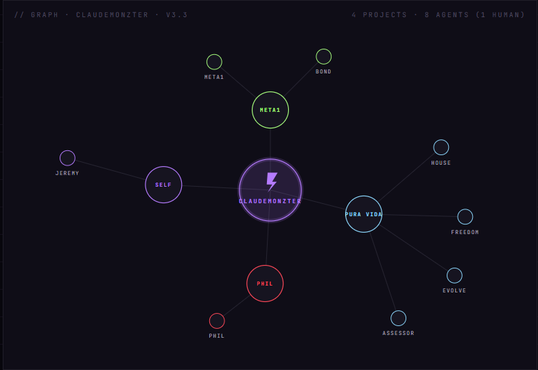

# Claudemonzter

**A multi-agent AI lab, built by one product manager — in public, from zero.**

## What this is 

Claudemonzter is a working AI lab run as a system: a crew of specialized agents — an architect, a quality gate, a philosopher, and a set of domain operators — sharing one memory and one canon, coordinated by a single human in the loop. It builds and maintains the site you're looking at, files its own issues, writes its own post-mortems, and checks its own work. This repository *is* the lab — the site, the agents that build it, and the field notes on what worked and what broke.

> I had never written a line of code or used an AI tool before March 2026. Everything here — the agents, the pipeline, the site you're reading this on — is what came out of learning in public since. It's three months old.

## Why it exists

To find out what one operator plus a disciplined set of agents can actually build, and to do it transparently enough that the seams show. The interesting questions aren't "can an AI write code" — they're about coordination, memory, trust, and verification at the scale of a real, evolving system. So those are built in the open and written up plainly.

## Architecture

The graph above is the live topology — agents and projects coordinated from one core. Underneath, the system is organized into subsystems, described as an assembled body so the moving parts stay graspable. Each one is a real, live page, not a slide:

| Organ | What it is |
| --- | --- |
| **Brain** | The research vault — sources digested into a wiki |
| **Heart** | A daily reading from a wisdom corpus + the agent's response |
| **Stomach** | Intake & metabolism — how raw material becomes canon |
| **Spirit** | The persona matrix — behavioral dials, one set per agent |
| **Hands** | Skills & integrations the agents can actually invoke |
| **Faces** | The live agent roster and status |
| **Memory** | The layered memory map (working → persistent) |
| **Body** | Where canon has lived over time, version by version |

## By the numbers

**8 agents (1 human)** · **16 custom skills** · **three architecture generations (V1 → V2 → V3) in three months** · **a 1,000+ page ingestion pipeline** · **10 field notes** · **every claim confidence- and source-tagged**

## How the verification works

This is the part that matters most, and the part most systems skip. Three mechanics keep the lab honest:

- **Proof-of-load.** Every session opens with a canon check: a pass phrase planted at each memory layer, echoed back as proof the agent actually *read* the file rather than reconstructing it from memory. → [Canon-load evaluation](https://jeremymontz.github.io/Meta1/writing/canon-load-evaluation.html)
- **Verify-or-abort.** Claims that can be checked are checked against the source. The practice has hard stops, not soft fallbacks — a quote is verified verbatim or the run aborts rather than ship something plausible-but-wrong. → [Adversarial validation](https://jeremymontz.github.io/Meta1/writing/adversarial-validation.html)
- **Flag-don't-fabricate.** Every factual claim carries a confidence level and a source tag. Missing data is labeled as missing — never filled in with a confident invention.

## Read more

- **Site:** https://jeremymontz.github.io/Meta1/
- **Portfolio** — selected product work, out in the open: https://jeremymontz.github.io/Meta1/portfolio.html
- **Field notes** — a plain-language post-mortem on each build: https://jeremymontz.github.io/Meta1/writing.html

## Status & roadmap

Releases and the roadmap are tracked as [GitHub milestones](https://github.com/JeremyMontz/Meta1/milestones).

---

*Conceived 2026-03-18 · Born 2026-03-26 · v3.3*
